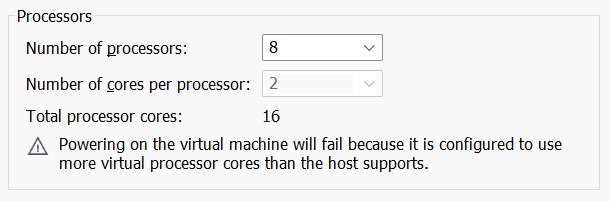
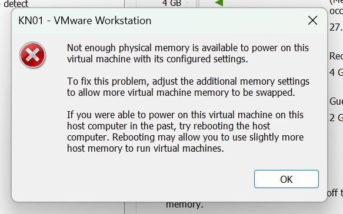

Ein Hypervisor, auch Virtual Machine Monitor (VMM) genannt, ist eine Software, die es ermöglicht, mehrere virtuelle Maschinen (VMs) auf einer einzigen physischen Hardware auszuführen. Er teilt die Hardware-Ressourcen effizient zwischen den VMs und sorgt für ihre Isolation und Verwaltung. Es gibt zwei Haupttypen von Hypervisoren:

1.	

Hypervisor Typ 1 (Bare Metal): Dieser wird direkt auf der physischen Hardware installiert und ersetzt ein Host-Betriebssystem. Er bietet direkten Zugriff auf die Hardware, wodurch er besonders leistungsstark und effizient ist. Typ-1-Hypervisoren werden vor allem in Unternehmensumgebungen, Rechenzentren und Cloud-Infrastrukturen verwendet, wo hohe Leistung, Sicherheit und Skalierbarkeit erforderlich sind. Beispiele sind VMware ESXi und Microsoft Hyper-V.

2.	

Hypervisor Typ 2 (Hosted): Dieser läuft als Softwareanwendung auf einem bestehenden Host-Betriebssystem und nutzt dessen Treiber und Ressourcen. Dies macht ihn einfacher zu implementieren, jedoch weniger leistungsstark und effizient, da die zusätzliche Schicht des Host-Betriebssystems Ressourcen beansprucht. Typ-2-Hypervisoren sind ideal für Einzelanwender und Entwicklungsumgebungen. Beispiele sind Oracle VirtualBox und VMware Workstation.

Der Hauptunterschied liegt in der Architektur: 
Typ 1 arbeitet direkt mit der Hardware, während Typ 2 auf einem Host-OS basiert. Typ 1 ist effizienter und sicherer, während Typ 2 einfacher zu bedienen ist und für weniger intensive Anwendungen geeignet ist.

### CPU-Test

### Aufgabe B 
Erklärung und Fazit

Warum gibt es Fehlermeldungen?
Es liegt daran, dass der Hypervisor nur die verfügbaren Ressourcen unseres Host-Systems nutzen kann. Das bestätig, dass es sich um einen Typ-2-Hypervisor handelt, der keine direkte Hardwaresteurung hat.

Kurzes Fazit
Unsere Vermutung, dass es sich um einen Hypervisor Typ 2 handelt, wurde bestätigt.