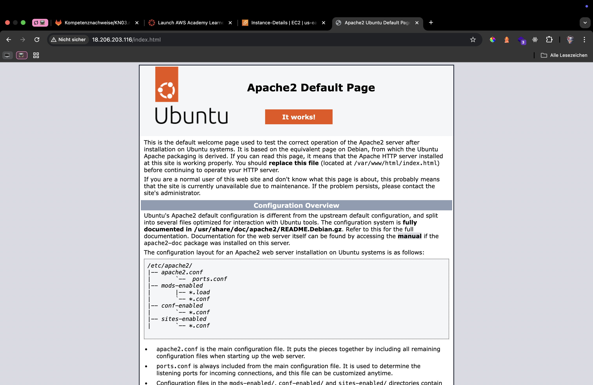
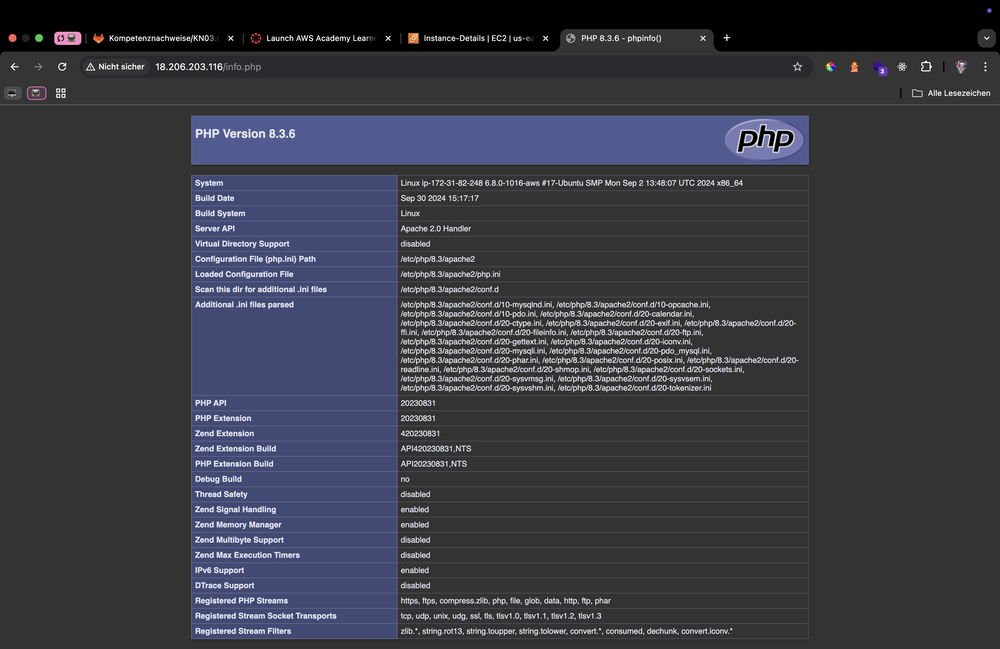
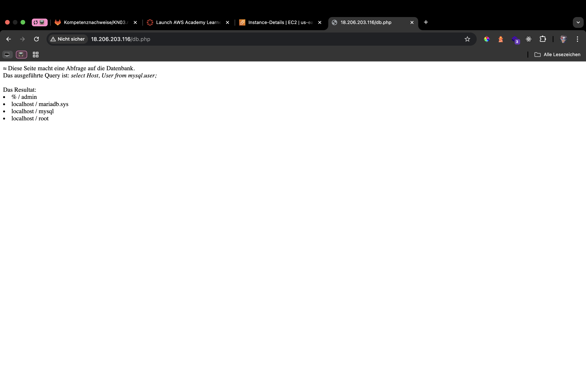
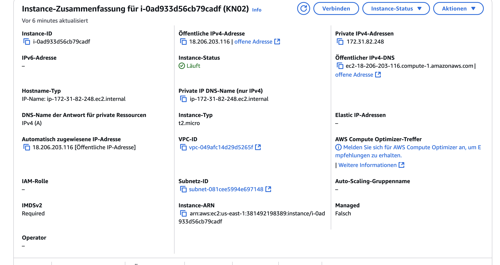
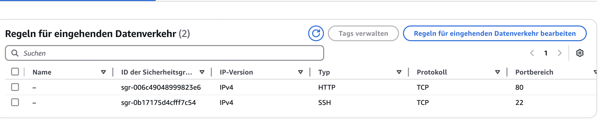
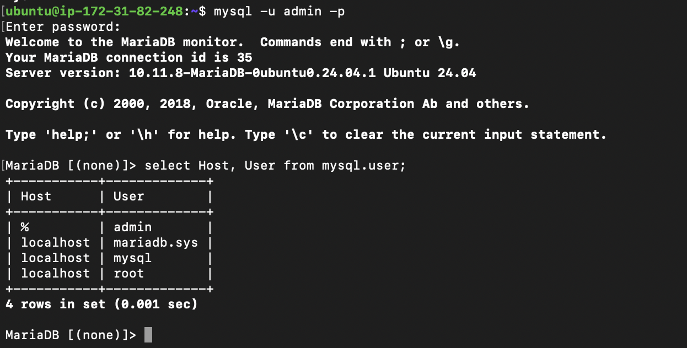

## index.html
 

## info.php
 

## dbphp
 

## ipadresse
 

## sicherheitsgruppe regeln
 

## sql tabelle


## Kurze Erklärung was die SQL-Abfrage (SELECT-Statement) ausliest.

```
SELECT Host, User FROM mysql.user;
```

Diese Abfrage zeigt die Spalten Host und User aus der Tabelle user, die in der Datenbank mysql gespeichert ist. Sie listet alle Benutzerkonten (User) sowie die zugehörigen Hosts (Host) auf, von denen aus diese Benutzer auf den Datenbankserver zugreifen dürfen.