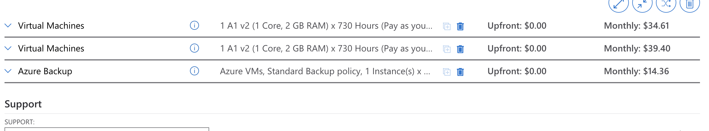
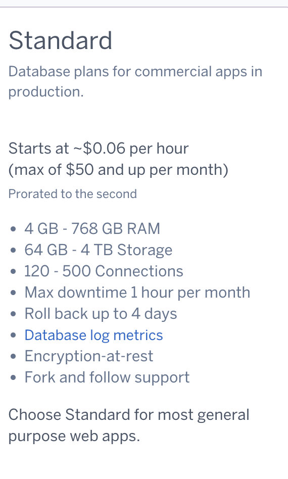
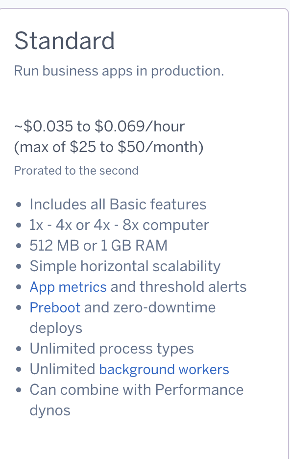
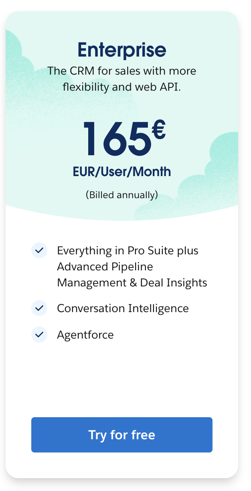
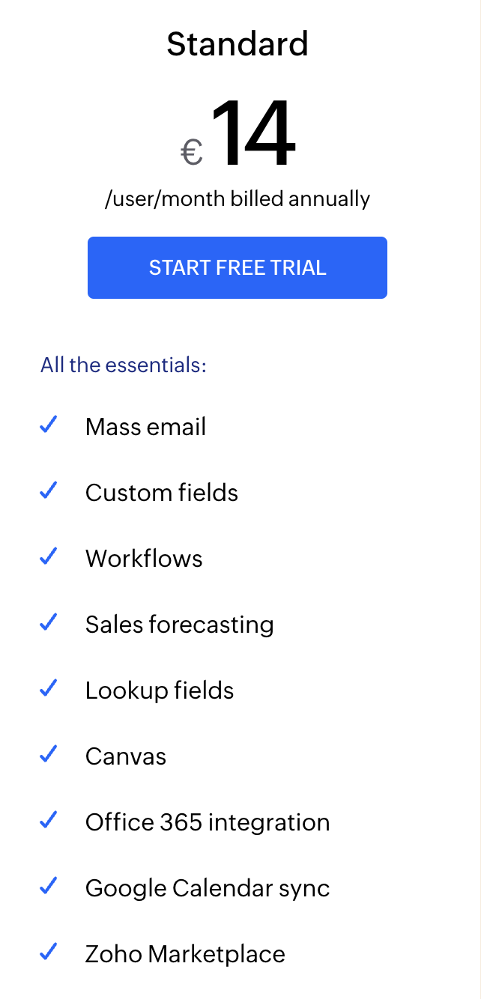

## KN10: Kostenberechnung
### A. Kostenberechnung IAAS - Rehosting
[AWS](aws_preisliste.pdf)

[Azure](azure.xlsx)

Begründung der Auswahl
	
1.	Leistungsanforderungen:

    •	Die Instanzen (t4g.small und t4g.medium) sind für den vorgesehenen Arbeitslasttyp (30 Benutzer, CRM-Software) optimiert.

    •	Flexible Skalierbarkeit ermöglicht es, die Infrastruktur bei steigenden Anforderungen anzupassen.

2.	Kostenoptimierung:

    • Die Auswahl von Instanzen mit ARM-basierten Graviton2-Prozessoren (t4g-Serie) reduziert die Kosten im Vergleich zu anderen Instanztypen bei ähnlicher Leistung.

    •	AWS Backup-Service ist kosteneffizient und vermeidet hohe Investitionen in On-Premise-Backup-Hardware.

3.	Flexibilität und Zukunftssicherheit:

    •	EBS-Speicher und EC2-Instanzen sind dynamisch skalierbar.

    •	Die Cloud-Infrastruktur bietet zusätzliche Sicherheitsfunktionen wie automatische Backups und Monitoring.

Zusammenfassung der Abweichungen:

• Mehr vCPUs auf dem Webserver (von 1 Core auf 2 vCPUs) für bessere Leistung.

• Verwendung von skalierbarem EBS-Speicher statt fester Festplatten.

• AWS Backup-Service ersetzt lokale Backup-Systeme, was die Verwaltung vereinfacht und langfristige Kosten senkt.

## B. Kostenrechnung PAAS - Replattforming

 

### Begründung zur Auswahl:

Der Standard Tier eignet sich für die meisten Webanwendungen, da er eine ausgewogene Kombination aus Leistung und Kosten bietet. Mit 1GB RAM und einer vCPU für den Webserver sowie 4GB RAM und 100GB Speicher für die Datenbank sind die grundlegenden Ressourcenanforderungen abgedeckt. Die Nutzung separater Dynos für Web und Datenbank ist trotz höherer Kosten empfehlenswert, um Performance und Sicherheit zu gewährleisten.

**Kostenvorteile Cloud vs. On-Premise:**

**Investitionskosten:**

Cloud: Keine Vorabinvestitionen

On-Premise: Hohe Hardware-Anschaffungskosten

**Betriebskosten:**

Cloud: Nutzungsbasierte Abrechnung

On-Premise: Fixkosten für Wartung, Strom, Kühlung

**Personalaufwand:**

Cloud: Reduzierter Administrationsaufwand

On-Premise: Dediziertes IT-Personal erforderlich

**Skalierung:**

Cloud: Flexible Anpassung nach Bedarf

On-Premise: Überdimensionierung für Lastspitzen nötig

Die verbrauchsbasierte Abrechnung und der reduzierte Verwaltungsaufwand machen die Cloud-Lösung besonders für kleinere bis mittlere Anwendungen kostengünstiger.

**Dynos ->**

Web Dynos:

Führen Webanwendungen aus
Verarbeiten HTTP-Anfragen
Ideal für Client-facing Anwendungen

## C. Kostenrechnung SAAS - Repurchasing

### Salesforce Enterprise (165€/Benutzer/Monat):

Empfehlenswert für:

Grosse Unternehmen mit komplexen Vertriebsprozessen
Teams, die umfangreiche Anpassungen benötigen
Unternehmen, die das grosse Salesforce-Ökosystem nutzen wollen

Vorteile:

Fortschrittliches Pipeline Management
Umfassende API-Möglichkeiten
Conversation Intelligence eingebaut
Marktführer mit grossem Partner-Netzwerk

### Zoho CRM Standard (14€/Benutzer/Monat):

Empfehlenswert für:

KMUs und Startups
Teams mit Standard-Vertriebsprozessen
Unternehmen mit begrenztem CRM-Budget

Vorteile:

Alle wichtigen CRM-Grundfunktionen
Gute Office & Google Integration
Workflow-Automatisierung
Sehr gutes Preis-Leistungs-Verhältnis

Empfehlung:

Zoho weil:

Standard CRM-Funktionen ausreichen
Kostenkontrolle wichtig ist
Einfache Integration mit Office/Google benötigt wird

Der massive Preisunterschied (151€) macht Zoho zur kosteneffizienteren Wahl.

## D. Interpretation der Resultate

### Vergleich der Migrationslösungen

### Kostenvergleich (monatlich für 30 Benutzer)

| **Lösung**         | **Monatliche Kosten** | **Zusätzliche Kosten**                         | **Gesamtkosten**  |
|---------------------|-----------------------|------------------------------------------------|-------------------|
| **AWS (IaaS)**      | $42.17               | Personal, Lizenzen, Schulungen                | Mittel-Hoch       |
| **Azure (IaaS)**    | $88.37               | Personal, Lizenzen, Schulungen                | Hoch              |
| **Heroku (PaaS)**   | $100.00              | Wenig                                          | Mittel            |
| **Zoho CRM (SaaS)** | €420.00              | Minimal                                        | Mittel            |
| **Salesforce (SaaS)** | €4.950.00           | Minimal                                        | Sehr hoch         |

---

## Aufwand für die Firma

| **Lösung**         | **Initialaufwand**          | **Kontinuierlicher Aufwand**   |
|---------------------|-----------------------------|---------------------------------|
| **AWS (IaaS)**      | Hoch                        | Sehr hoch                       |
| **Azure (IaaS)**    | Hoch                        | Sehr hoch                       |
| **Heroku (PaaS)**   | Mittel                      | Gering                         |
| **Zoho CRM (SaaS)** | Gering                      | Minimal                        |
| **Salesforce (SaaS)** | Gering                    | Minimal                        |

---

## Begründung der Kostenunterschiede

| **Lösung**         | **Gründe für Kostenunterschiede**                                                                                                   |
|---------------------|------------------------------------------------------------------------------------------------------------------------------------|
| **AWS/Azure (IaaS)** | Niedrigere Direktkosten, hohe versteckte Kosten durch Personal und Wartung. Maximale Kontrolle und Anpassbarkeit.                   |
| **Heroku (PaaS)**   | Gute Balance zwischen Kontrolle und Verwaltungsaufwand. Weniger versteckte Kosten durch weniger Verantwortung für die Infrastruktur. |
| **Zoho CRM (SaaS)** | Kosteneffizient für KMU, wenn Standard-Funktionen ausreichen. Keine Infrastruktur- oder Wartungskosten.                             |
| **Salesforce (SaaS)** | Höhere Kosten durch umfassende Enterprise-Funktionen. Zielgruppe sind grosse Unternehmen mit komplexen Anforderungen.                |

---

### Empfehlung

Für ein KMU mit 30 Benutzern wäre **Zoho CRM** die kosteneffizienteste Lösung mit dem geringsten Aufwand, solange die Standard-Funktionalität ausreicht. 

**Wenn nicht Zoro dann:**

**Heroku** bietet eine gute Alternative, wenn mehr Anpassbarkeit benötigt wird, während **AWS** und **Azure** hohe Flexibilität, jedoch auch hohe laufende Kosten und Verwaltungsaufwand erfordern.

